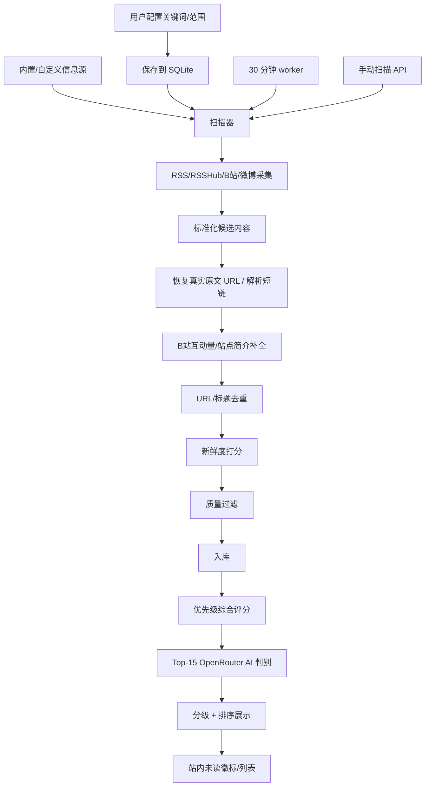

# 游戏热点雷达架构方案

## 总体方案

项目采用前后端分离但同仓库开发的轻量架构：

- 前端：React + Vite + TypeScript + TailwindCSS
- 后端：Node.js + Express + TypeScript
- 数据库：SQLite + better-sqlite3
- 定时任务：Node worker + 原生分钟级定时器
- RSS/XML 解析：fast-xml-parser
- AI：OpenRouter Chat Completions + JSON Schema

该方案更适合本机常驻工具，而不是重型 SaaS。前端专注交互展示，后端负责采集、AI 判别、数据持久化和定时扫描，后续 Agent Skill 可以复用后端扫描逻辑。

## 技术选型

| 层级 | 技术 | 理由 |
|---|---|---|
| 前端框架 | React + Vite + TypeScript | 开发快、HMR 快、适合工具型 SPA |
| 样式 | TailwindCSS v4 + `@tailwindcss/vite` | 当前推荐 Vite 插件接入，响应式和定制视觉效率高 |
| 图标 | lucide-react | 轻量、统一、适合按钮和状态标识 |
| 后端 API | Express + TypeScript | 简单直接，适合轻量 API 和本机服务 |
| 后台任务 | Node worker + `setInterval` | 支持 5-1440 分钟间隔，避免 cron 步进在 60 分钟以上失效；并发保护由扫描器内部锁完成 |
| 数据库 | SQLite + better-sqlite3 | 本地文件数据库，无需外部服务，prepared statement 简洁 |
| RSS/XML | fast-xml-parser | 当前文档可查，直接解析 RSS/Atom XML，避免文档缺失库 |
| AI | OpenRouter | OpenAI-compatible API，支持 Bearer 鉴权和结构化输出 |
| 测试 | Vitest + Supertest | 适合 TypeScript 项目，覆盖服务和 API |

## 最新文档要求

开发和后续维护时，涉及库、SDK、API、CLI、云服务的实现问题，必须先用 Context7 MCP 获取当前文档：

1. 调用 `resolve-library-id` 确认库 ID。
2. 调用 `query-docs` 查询用户问题或具体实现点。
3. 按查询到的当前文档实现。

本方案制定阶段已通过 Context7 查询过：

| 技术 | Context7 库 ID |
|---|---|
| OpenRouter | `/llmstxt/openrouter_ai_llms-full_txt` |
| Vite | `/vitejs/vite` |
| Express | `/expressjs/express` |
| TailwindCSS | `/tailwindlabs/tailwindcss.com` |
| better-sqlite3 | `/wiselibs/better-sqlite3` |
| fast-xml-parser | `/naturalintelligence/fast-xml-parser` |

## 数据流



## 推荐目录结构

```txt
E:\热点工具
├─ docs/
│  ├─ requirements.md
│  ├─ architecture.md
│  ├─ openrouter-setup.md
│  ├─ source-plan.md
│  ├─ progress.md
│  └─ acceptance-checklist.md
├─ package.json
├─ .env.example
├─ index.html
├─ vite.config.ts
├─ tsconfig.json
├─ src/
│  ├─ main.tsx
│  ├─ app/
│  ├─ components/
│  ├─ api-client/
│  └─ styles/
├─ server/
│  ├─ index.ts
│  ├─ worker.ts
│  ├─ routes/
│  ├─ services/
│  │  ├─ ai.ts
│  │  ├─ collector.ts
│  │  ├─ scanner.ts
│  │  ├─ sourcePresets.ts
│  │  └─ dedupe.ts
│  ├─ db/
│  │  ├─ client.ts
│  │  └─ schema.ts
│  └─ config/
├─ data/
├─ tests/
└─ skills/
   └─ game-hotspot-monitor/
```

## 后端模块

| 模块 | 职责 |
|---|---|
| `server/index.ts` | 启动 Express API，生产模式托管前端静态资源 |
| `server/worker.ts` | 启动定时扫描任务 |
| `server/routes/*` | API 路由，包括关键词、来源、热点、设置、扫描 |
| `server/services/collector.ts` | 拉取 RSS/RSSHub/可选 Google News 并标准化内容 |
| `server/services/enrichment.ts` | 恢复真实原文 URL，并 Best-effort 补充 B站互动量和游戏网站简介 |
| `server/services/ai.ts` | 调用 OpenRouter 或 Mock AI |
| `server/services/scanner.ts` | 编排一次完整扫描流程 |
| `server/services/dedupe.ts` | URL、标题近似、时间窗口去重 |
| `server/db/client.ts` | SQLite 连接与 prepared statements |
| `server/db/schema.ts` | 表结构初始化 |

## 前端模块

| 模块 | 职责 |
|---|---|
| 工作台首页 | 展示扫描状态、未读数、热点列表 |
| 关键词面板 | 新增、禁用、删除关键词 |
| 来源面板 | 查看和编辑内置/自定义来源 |
| 热点流卡片 | 展示标题、简介、互动量与标题直跳原文 |
| 设置面板 | 扫描频率、AI 模式、OpenRouter 配置状态 |

## API 设计

| 方法 | 路径 | 说明 |
|------|------|------|
| `GET` | `/api/health` | 服务健康检查 |
| `GET` | `/api/dashboard` | 获取仪表盘 |
| `GET` | `/api/settings` | 获取配置 |
| `PATCH` | `/api/settings` | 更新扫描频率、AI 模式等 |
| `GET` | `/api/keywords` | 获取关键词 |
| `POST` | `/api/keywords` | 新增关键词（自动判别游戏/非游戏、账号/话题） |
| `PATCH` | `/api/keywords/:id` | 更新关键词 |
| `DELETE` | `/api/keywords/:id` | 删除关键词 |
| `GET` | `/api/sources` | 获取信息源 |
| `POST` | `/api/sources` | 新增来源 |
| `PATCH` | `/api/sources/:id` | 更新来源 |
| `DELETE` | `/api/sources/:id` | 删除来源 |
| `GET` | `/api/items` | 获取热点列表 |
| `PATCH` | `/api/items/:id/read` | 标记已读 |
| `POST` | `/api/scan` | 手动触发扫描 |
| `GET` | `/api/summary` | AI 简报 |
| `GET` | `/api/items/archived` | 获取归档列表 |
| `POST` | `/api/items/:id/restore` | 恢复单条归档 |
| `POST` | `/api/items/batch-restore` | 批量恢复归档 |
| `POST` | `/api/items/batch-delete` | 批量删除归档 |
| `POST` | `/api/items/archive-stale` | 手动归档过期内容 |

## 数据表

| 表 | 用途 | 关键新增字段 |
|---|---|---|
| `settings` | 保存扫描频率、AI 模式等配置 | — |
| `keywords` | 保存用户关键词和热点范围 | `account_mode`、`account_platform`、`account_uid`、`account_url`：账号/话题自动识别 |
| `sources` | 保存内置与自定义信息源 | `provider_type`、`reliability_tier`、`community_source`、`min_quality_score` |
| `items` | 保存热点候选内容和状态 | `archived_at`：归档时间；`interaction_likes/reposts/replies/views`：互动量；`summary_source`、`interaction_source`、`quality_score`、`quality_signals`、`evidence_count` |
| `ai_evaluations` | 保存 AI 结构化评分和理由 | — |
| `scan_runs` | 保存扫描日志、耗时、错误 | — |
| `item_evidence` | 保存多源证据合并记录 | provider、source、query、rank、URL 等 |

### 新增 API

| 方法 | 路径 | 说明 |
|------|------|------|
| `GET` | `/api/items/archived` | 获取归档列表 |
| `POST` | `/api/items/:id/restore` | 恢复单条归档 |
| `POST` | `/api/items/batch-restore` | 批量恢复归档 |
| `POST` | `/api/items/batch-delete` | 批量删除归档 |

## UI 方向

视觉主题为“游戏行业情报雷达”：

- 深色工作台背景
- 扫描线、热度光谱、未读脉冲等轻量动效
- 不做普通卡片堆叠后台
- 页面首屏直接是可操作工作台，不做营销式落地页
- 移动端保留核心操作：查看热点、标记已读、立即扫描

## Agent Skill 后置原则

Web 版验收通过后，再创建 `skills/game-hotspot-monitor`：

- Skill 只描述如何调用已有扫描能力，不复制一套业务逻辑。
- Skill 应包含关键词配置、扫描执行、结果解释、避免重复推送的流程。
- Skill 创建时继续遵守当前 Skill Creator 指南。

## 本地终端

Windows 环境推荐使用 Git Bash 运行开发命令，避免 PowerShell 执行策略拦截 `npm.ps1`。详见 `docs/dev-setup.md`。
