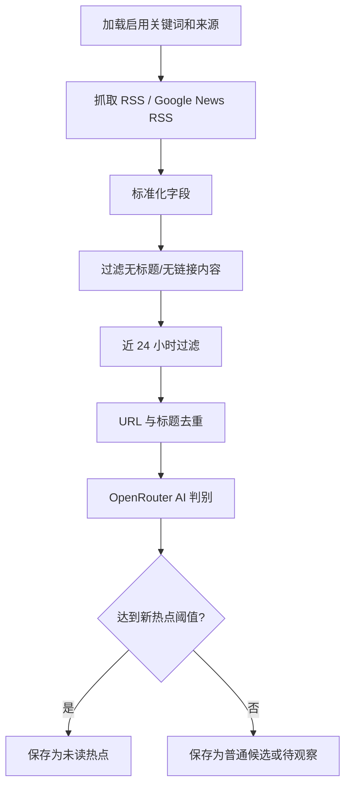

# 信息源与热点发现方案

## 信息源原则

v1 信息源收敛为“国内平台优先”。主要从国内各大平台、国内游戏媒体、社区讨论和中文综合新闻里发现热点；海外引擎、平台和 AI 技术更新不再作为默认主来源，只作为后续用户自定义来源补充。

来源必须满足至少一个条件：

1. 能提供 RSS 或可构造 Google News RSS 查询。
2. 有稳定 URL 和发布时间。
3. 与游戏行业、游戏技术、AI 编程、行业动态高度相关。
4. 内容适合 AI 做可信度和新鲜度判断。

## 来源类型

| 类型 | 说明 | v1 处理 |
|---|---|---|
| 固定 RSS | 具体站点或栏目 RSS | 内置，可编辑 |
| Google News RSS | 由关键词构造新闻搜索 RSS | 内置生成 |
| 自定义 RSS | 用户页面新增 | 保存到 SQLite |
| 自定义关键词源 | 用户输入范围，如“AI 编程” | 用于生成搜索 RSS |

## 内置来源分类

| 分类 | 覆盖 |
|---|---|
| 国内综合 | 中文新闻聚合中的游戏、手游、厂商、版号动态 |
| 国内平台 | 微博、B站、TapTap、知乎、微信公众号、百度贴吧等平台信号 |
| 国内媒体 | 游戏葡萄、竞核、游研社、触乐等游戏行业媒体信号 |
| 游戏商业与出海 | 买量、发行、用户研究、商业化、海外市场，但优先中文来源 |

## Google News RSS 查询

对用户关键词和范围构造查询，例如：

```txt
https://news.google.com/rss/search?q=<encoded query>&hl=zh-CN&gl=CN&ceid=CN:zh-Hans
```

示例 query：

```txt
游戏 AI
AI 编程
米哈游 新作
腾讯游戏 发行
微博 游戏 AI
B站 Unity 游戏
TapTap 新游 测试
知乎 游戏出海
微信公众号 游戏行业
```

## 候选内容标准化

采集后统一转为 `RawFeedItem`：

| 字段 | 说明 |
|---|---|
| `sourceId` | 来源 ID |
| `sourceName` | 来源名称 |
| `title` | 标题 |
| `url` | 原文链接 |
| `summary` | 摘要或 description |
| `publishedAt` | 发布时间 |
| `fetchedAt` | 抓取时间 |
| `matchedKeyword` | 命中的关键词 |
| `rawPayload` | 原始内容 JSON |

## RSS / Atom 解析

使用 `fast-xml-parser` 解析 XML：

- RSS 读取 `rss.channel.item`
- Atom 读取 `feed.entry`
- 支持单条和数组两种结构
- 保留标题、链接、发布时间、摘要
- XML 格式异常时记录来源错误，不中断其他来源

## 去重策略

| 策略 | 说明 |
|---|---|
| URL 去重 | 标准化 URL，去除常见 tracking 参数 |
| 标题近似去重 | 标题归一化后计算相似度 |
| 时间窗口 | 默认只关注近 24 小时 |
| 来源重复 | 多来源同一内容保留最早发现记录，可追加来源引用 |

URL 归一化需要去除：

```txt
utm_source
utm_medium
utm_campaign
utm_term
utm_content
fbclid
gclid
```

## 热点发现逻辑



## 来源编辑规则

用户可以在页面上：

- 新增 RSS 来源
- 修改来源名称和分类
- 启用/禁用来源
- 删除自定义来源
- 禁用内置来源

内置来源不直接物理删除，只做禁用，方便恢复。

## 扫描频率

默认每 30 分钟扫描一次。

| 设置 | 行为 |
|---|---|
| `SCAN_INTERVAL_MINUTES=30` | 默认频率 |
| 页面修改频率 | 保存到 settings |
| worker 启动 | 读取 settings 优先，其次读取 env |
| 手动扫描 | 不受频率限制，但需要避免并发扫描 |

node-cron 任务必须设置 no-overlap 或等价保护，避免上一次扫描未完成时重复启动。

## 失败处理

| 失败 | 处理 |
|---|---|
| 单个来源抓取失败 | 记录错误，继续其他来源 |
| XML 解析失败 | 记录错误，跳过该来源 |
| 发布时间缺失 | 使用抓取时间，但降低新鲜度 |
| AI 判别失败 | 标记待重试或使用 Mock 兜底 |
| 全部来源失败 | scan_runs 记录失败状态 |

## 后续可扩展

| 能力 | 说明 |
|---|---|
| Telegram 通知 | v2 可加 |
| Webhook | v2 可加飞书/企微/Discord |
| 付费搜索 API | 如果 Google News RSS 覆盖不足再接 |
| 来源可信度权重 | 根据来源长期质量调整分数 |
| 周报 | 基于历史热点自动生成周报 |
