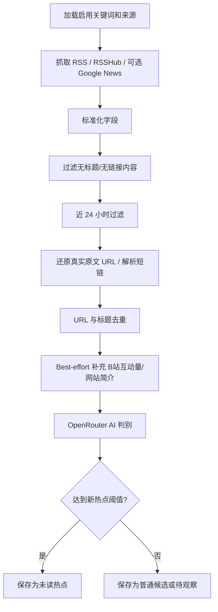

# 信息源与热点发现方案

## 信息源原则

v1 信息源收敛为“国内无 Key 来源优先 + 直连优先”。主要从国内游戏媒体、RSSHub 桥接、中文综合搜索和可直接访问的站点 RSS 里发现热点；Google News 只保留为可选补充和原文恢复兜底，不作为默认主来源。

来源必须满足至少一个条件：

1. 能提供 RSS 或可构造 Google News RSS 查询。
2. 有稳定 URL 和发布时间。
3. 与游戏行业、游戏技术、AI 编程、行业动态高度相关。
4. 内容适合 AI 做可信度和新鲜度判断。

## 来源类型

| 类型 | 说明 | v1 处理 |
|---|---|---|
| 固定 RSS | 具体站点或栏目 RSS | 内置，可编辑 |
| RSSHub 搜索 | 由关键词构造国内搜索 RSS | 默认启用 |
| Google News RSS | 由关键词构造新闻搜索 RSS | 可选补充，默认禁用 |
| 自定义 RSS | 用户页面新增 | 保存到 SQLite |
| 账号源 | 用户输入账号/官方/博主 URL 或 UID | 可直达账号视频/动态 RSS |

## 内置来源分类

| 分类 | 覆盖 | v1 状态 |
|---|---|---|
| 国内综合 | 中文新闻聚合中的游戏、手游、厂商、版号动态 | 已启用 |
| 国内媒体 | 机核网、游民星空、3DM、游戏葡萄、竞核等游戏行业媒体信号 | 已启用 |
| 国内平台（社区） | 微博、B站、TapTap、知乎、微信公众号、百度贴吧 | **泛搜索已禁用**（B站仅做账号/视频增强） |
| 国内 RSS 直连 | 机核网 RSS、RSSHub 桥接（游民星空/3DM/搜狐/网易） | 已启用 |
| 游戏商业与出海 | 买量、发行、用户研究、商业化、海外市场 | 保留 |
| 搜索增强 | Brave Search（需 API Key） | 可选，默认禁用 |

### v1 社区源禁用说明

微博、B站、TapTap、知乎、贴吧 5 个社区泛搜索源已设为 `enabled: false`。原因：
- 社区帖互动量难以从标题准确提取
- 低质量回复/评论内容混入严重
- 缺乏作者粉丝数、认证状态等可信度信号
- 后续若接入平台 API 获取真实互动数据后可重新启用
- B站保留账号源与视频互动补全，不做泛社区搜索

### 国内直连 RSS 源（v1 当前活跃）

这些源无需 API Key，无需翻墙，直接 HTTP 抓取：

| 源名称 | URL | 类型 | 说明 |
|--------|-----|------|------|
| **机核网** | `gcores.com/rss` | RSS 直连 | 游戏文化/新闻，30条/次 |
| **游研社** | `yystv.cn/rss/feed` | RSS 直连 | 游戏历史/文化/产业，12条/次 |
| **触乐** | `chuapp.com/feed` | RSS 直连 | 游戏新闻/评测/产业，30条/次 |
| **B站视频搜索** | `api.bilibili.com` | 公开 API | 视频搜索，≥1000 播放过滤 |
| **微博热搜** | `weibo.com/ajax/side/hotSearch` | 公开 API | 热搜榜，5分钟缓存，按关键词+游戏词库过滤 |
| **RSSHub 百度搜索** | `rsshub.rssforever.com/baidu/search/{query}` | RSSHub 桥接 | 关键词搜索，引号精确匹配 + 排除 CSDN/知乎/简书 |

### 已停用源

| 源名称 | 停用原因 |
|--------|----------|
| 游民星空 | 噪音内容多，过滤效果不稳定 |
| 3DM/搜狐/网易/17173 | RSSHub 路由返回 503 |
| B站账号视频/动态 | RSSHub B站路由返回 503 |
| Google News 全系列 | 国内不可用 |
| 微博/B站/TapTap/知乎/贴吧 社区搜索 | 低质回复/评论混入严重 |

### 关键词自动判别

系统自动检测关键词是否为游戏话题（含游戏/电竞/主机/Steam/Unity 等 19 个词），非游戏词自动跳过机核网/游研社/触乐，仅查百度+B站+微博。

### 账号/官方/博主源

如果关键词本身是博主、官方号、团队或账号 URL，系统优先使用账号源：

| 平台 | 识别方式 | 源 |
|------|----------|----|
| B站 | `space.bilibili.com/<uid>` 或 `uid:<uid>` | `https://rsshub.rssforever.com/bilibili/user/video/{accountUid}` |
| B站 | 同上 | `https://rsshub.rssforever.com/bilibili/user/dynamic/{accountUid}` |

不能唯一识别账号时，只标记 `account_mode`，仍走普通国内搜索，不自动冒认官方号。

> RSSHub (`rsshub.rssforever.com`) 是国内开源项目，免费提供各站点 RSS 桥接，无需注册或 API Key。

## RSSHub / Google News 查询

默认优先使用 RSSHub 百度搜索：

```txt
https://rsshub.rssforever.com/baidu/search/<encoded query>
```

Google News RSS 仅作为可选补充，默认禁用：

```txt
https://news.google.com/rss/search?q=<encoded query>&hl=zh-CN&gl=CN&ceid=CN:zh-Hans
```

示例 query：

```txt
游戏 AI
AI 编程
米哈游 新作
腾讯游戏 发行
微博 游戏 AI
B站 Unity 游戏
TapTap 新游 测试
知乎 游戏出海
微信公众号 游戏行业
```

## 候选内容标准化

采集后统一转为 `RawFeedItem`：

| 字段 | 说明 |
|---|---|
| `sourceId` | 来源 ID |
| `sourceName` | 来源名称 |
| `title` | 标题 |
| `url` | 原文链接 |
| `summary` | 摘要或 description |
| `publishedAt` | 发布时间 |
| `fetchedAt` | 抓取时间 |
| `matchedKeyword` | 命中的关键词 |
| `rawPayload` | 原始内容 JSON |

## RSS / Atom 解析

使用 `fast-xml-parser` 解析 XML：

- RSS 读取 `rss.channel.item`
- Atom 读取 `feed.entry`
- 支持单条和数组两种结构
- 保留标题、链接、发布时间、摘要
- XML 格式异常时记录来源错误，不中断其他来源

## 去重策略

| 策略 | 说明 |
|---|---|
| URL 去重 | 标准化 URL，去除常见 tracking 参数 |
| 标题近似去重 | 标题归一化后计算相似度 |
| 时间窗口 | 默认只关注近 24 小时，旧内容进入归档 |
| 来源重复 | 多来源同一内容保留最早发现记录，可追加来源引用 |

URL 归一化需要去除：

```txt
utm_source
utm_medium
utm_campaign
utm_term
utm_content
fbclid
gclid
```

## 热点发现逻辑



## 来源编辑规则

用户可以在页面上：

- 新增 RSS 来源
- 修改来源名称和分类
- 启用/禁用来源
- 删除自定义来源
- 禁用内置来源

内置来源不直接物理删除，只做禁用，方便恢复。

## 扫描频率

默认每 30 分钟扫描一次。

| 设置 | 行为 |
|---|---|
| `SCAN_INTERVAL_MINUTES=30` | 默认频率 |
| 页面修改频率 | 保存到 settings |
| worker 启动 | 读取 settings 优先，其次读取 env |
| 手动扫描 | 不受频率限制，但需要避免并发扫描 |

node-cron 任务必须设置 no-overlap 或等价保护，避免上一次扫描未完成时重复启动。

## 失败处理

| 失败 | 处理 |
|---|---|
| 单个来源抓取失败 | 记录错误，继续其他来源 |
| XML 解析失败 | 记录错误，跳过该来源 |
| 发布时间缺失 | 使用抓取时间，但降低新鲜度 |
| 互动/简介补全失败 | 保留原始 RSS 数据，扫描不中断 |
| AI 判别失败 | 标记待重试或使用 Mock 兜底 |
| 全部来源失败 | scan_runs 记录失败状态 |

## 后续可扩展

| 能力 | 说明 |
|---|---|
| Telegram 通知 | v2 可加 |
| Webhook | v2 可加飞书/企微/Discord |
| 付费搜索 API | 如果 RSSHub/站点 RSS 覆盖不足再接 |
| 来源可信度权重 | 根据来源长期质量调整分数 |
| 周报 | 基于历史热点自动生成周报 |
